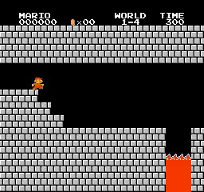
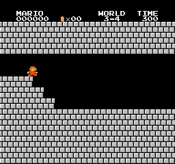
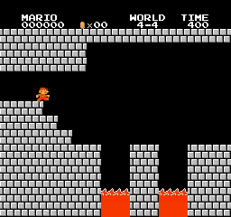
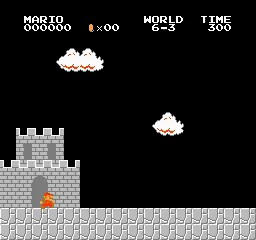

# Mario_PPO
Playing Super Mario Bros with Proximal Policy Optimization (PPO)

## Introduction

My PyTorch Proximal Policy Optimization (PPO) implement to playing Super Mario Bros.

  
  
  
   
  
  
  
   
  
  
  
   
  
  
  
   
  
  
  
   
  
  
  
   
  
  
  
   
  
  
  
   
  <i>Results</i>

## Motivation

I tried implementing [A2C](https://github.com/CVHvn/Mario_A2C) to train the agent to play Super Mario Bros game. But A2C only completed 26/32 stages and I saw some other people completed 31/32 stages with PPO so I implemented PPO to play Mario. Implementing it myself also helps me better understand the algorithm.

## How to use it

You can use my notebook for training and testing agent very easy:
* **Train your model** by running all cell before session test
* **Test your trained model** by running all cell except agent.train(), just pass your model path to agent.load_model(model_path)

Or you can use **train.py** and **test.py** if you don't want to use notebook:
* **Train your model** by running **train.py**: For example training for stage 1-4: python train.py --world 1 --stage 4 --num_envs 8
* **Test your trained model** by running **test.py**: For example testing for stage 1-4: python test.py --world 1 --stage 4 --pretrained_model best_model.pth --num_envs 2

## Trained models

You can find trained model in folder [trained_model](trained_model)

## Hyperparameters

Default parameter set:
* Because I adjust the parameters for each stage, the optimal set of parameters that I recommend below is different from the parameters I train for the stages in the table below.
* I don't have enough time and resources to test again, however I ran 2 stages such as 1-1, 1-4 and found that the default parameters I recommended were good enough.
* num_envs: 8 (only need 16 for hard stages)
* learn_step: 512 (to reach full episode)
* batchsize: 64 (Best when experimenting)
* epoch: 10 (not effect)
* gamma: 0.9 (only need 0.99 for special stages)
* learning_rate: 7e-5 (not effect too much)
* target_kl: 0.05 (Best when experimenting)
* norm_adv: False (Best when experimenting)
* loss_type: mse (not effect too much)
* gae_lambda: 0.95 (I don't tuning this parameter)

How did I find the hyperparameters for each stage:
* First, I combined the default parameters from my PPO stable baselines 3 and A2C: stage 1-1 hyperparameters (I found num_envs to be 8 good enough for PPO while A2C requires 16 to be good)
* Every time training fails, I adjust the parameters, initially I just adjust them randomly: learning_rate between 1e-5 and 1e-3, use norm advantage or not, gamma 0.9 or 0.99, learn step is 256 or 512 , batch size is 64 or 256.
* Through many stages, I recognized important parameters and understood that some stages needed to adjust a few parameters.
* learn_step should always be 512 because it ensures the agent will see the entire episode (256 is shorter than the number of epsiodes) especially for long episodes (I choose 512 as default).
* norm_adv is usually not useful, sometimes it helps train faster (by default I won't need norm_adv)
* loss_type is mse would be better, I find that unlike DQL, value network does not need stability from huber, mse is enough (default will be mse).
* gamma is 0.9 for easy stages, when training fails with 0.9, try with 0.99 (harder stages often need gamma = 0.99)
* learning_rate does not affect too much (should be set to 7e-5)
* epoch have no effect
* target_kl is importance to make agent learn stablize. But I can completed 30/31 stages (except 5-3) without target_kl. You can see that 30 stages used target_kl is None. But I can't tuning hyperparameters to complete stage 5-3. Than I use target_kl and find that with target_kl = 0.05, I can completed stage 5-3.

| World | Stage | num_envs | learn_step | batchsize | epoch | gamma | learning_rate | target_kl | norm_adv | loss_type | training_step | training_time  |
|-------|-------|----------|------------|-----------|-------|-------|---------------|-----------|----------|-----------|---------------|----------------| 
| 1     | 1     | 8        | 256        | 64        | 10    | 0.9   | 1e-4          | None      | True     | huber     | 55975         | 0:37:39        |
| 1     | 2     | 8        | 256        | 64        | 10    | 0.9   | 1e-4          | None      | True     | huber     | 387965        | 3:00:54        |
| 1     | 3     | 16       | 512        | 64        | 10    | 0.99  | 1e-4          | None      | False    | mse       | 262984        | 5:08:55        |
| 1     | 4     | 8        | 256        | 64        | 10    | 0.9   | 1e-4          | None      | True     | huber     | 19969         | 0:14:20        |
| 2     | 1     | 8        | 256        | 64        | 10    | 0.9   | 1e-4          | None      | True     | huber     | 1220983       | 7:39:52        |
| 2     | 2     | 8        | 512        | 256       | 10    | 0.9   | 1e-4          | None      | False    | huber     | 1311983       | 11:23:30       |
| 2     | 3     | 8        | 256        | 64        | 10    | 0.9   | 1e-4          | None      | True     | huber     | 103997        | 1:01:56        |
| 2     | 4     | 8        | 256        | 64        | 10    | 0.9   | 1e-4          | None      | True     | huber     | 264986        | 2:11:13        |
| 3     | 1     | 8        | 256        | 64        | 10    | 0.9   | 1e-4          | None      | False    | huber     | 540992        | 5:39:07        |
| 3     | 2     | 8        | 256        | 64        | 10    | 0.9   | 1e-4          | None      | True     | huber     | 59981         | 0:41:55        |
| 3     | 3     | 16       | 512        | 256       | 10    | 0.99  | 1e-4          | None      | False    | huber     | 65994         | 0:44:40        |
| 3     | 4     | 8        | 256        | 64        | 10    | 0.9   | 1e-4          | None      | True     | huber     | 28992         | 0:21:35        |
| 4     | 1     | 8        | 256        | 64        | 10    | 0.9   | 1e-4          | None      | True     | huber     | 84996         | 0:53:47        |
| 4     | 2     | 16       | 512        | 64        | 10    | 0.99  | 7e-5          | None      | False    | mse       | 390654        | 9:42:05        |
| 4     | 3     | 16       | 512        | 64        | 10    | 0.99  | 7e-5          | None      | False    | mse       | 73968         | 1:27:08        |
| 4     | 4     | 16       | 512        | 256       | 10    | 0.99  | 1e-4          | None      | True     | mse       | 227983        | 4:17:04        |
| 5     | 1     | 8        | 256        | 64        | 10    | 0.9   | 1e-4          | None      | True     | huber     | 111944        | 1:22:04        |
| 5     | 2     | 8        | 256        | 64        | 10    | 0.9   | 1e-4          | None      | False    | huber     | 468979        | 4:54:56        |
| 5     | 3     | 16       | 512        | 64        | 10    | 0.99  | 7e-5          | 0.05      | False    | huber     | 613996        | 7:56:56        |
| 5     | 4     | 8        | 256        | 64        | 10    | 0.9   | 1e-4          | None      | True     | huber     | 648972        | 6:05:24        |
| 6     | 1     | 8        | 512        | 256       | 10    | 0.9   | 1e-4          | None      | False    | huber     | 159955        | 1:14:31        |
| 6     | 2     | 8        | 512        | 256       | 10    | 0.9   | 1e-4          | None      | False    | huber     | 1165994       | 10:29:06       |
| 6     | 3     | 16       | 512        | 64        | 10    | 0.99  | 7e-5          | None      | False    | mse       | 151961        | 2:49:34        |
| 6     | 4     | 8        | 256        | 64        | 10    | 0.9   | 1e-4          | None      | True     | huber     | 94996         | 0:53:33        |
| 7     | 1     | 8        | 256        | 64        | 10    | 0.9   | 1e-4          | None      | True     | huber     | 280000        | 2:44:50        |
| 7     | 2     | 8        | 512        | 256       | 10    | 0.9   | 1e-4          | None      | False    | huber     | 2951967       | 1 day, 1:14:32 |
| 7     | 3     | 8        | 256        | 64        | 10    | 0.9   | 1e-4          | None      | True     | huber     | 491992        | 4:37:12        |
| 7     | 4     | 16       | 512        | 256       | 10    | 0.9   | 1e-4          | None      | False    | mse       | 169994        | 3:16:36        |
| 8     | 1     | 16       | 512        | 256       | 10    | 0.9   | 1e-4          | None      | False    | huber     | 1450982       | 13:09:19       |
| 8     | 2     | 16       | 512        | 256       | 10    | 0.9   | 1e-4          | None      | True     | huber     | 699985        | 7:44:43        |
| 8     | 3     | 16       | 512        | 256       | 10    | 0.9   | 1e-4          | None      | True     | huber     | 1964979       | 19:12:40       |

## Questions

* Is this code guaranteed to complete the stages if you try training?
  
  - This hyperparameter does not guarantee you will complete the stage. But I am sure that you can win with this hyperparameter except you have a unlucky day (need 2-3 times to win because of randomness)

* How long do you train agents?
  
  - Within a few hours to more than 1 day. Time depends on hardware, I use many different hardware so time will not be accurate.

* How can you improve this code?
  
  - You can separate the test agent part into a separate thread or process. I'm not good at multi-threaded programming so I don't do this.

* Compare with A2C?

  - It can be clearly seen that PPO is better, it can complete more difficult stages and learn how to go left to win (stages 4-4). 
  - Training time with PPO is generally significantly reduced because PPO is a more powerful algorithm, can work with 8 environments and usually does not reduce performance.
  - PPO also has more hyperparameters so it requires more tuning or experience compared to A2C.

* Why still not complete stage 8-4:
  - First, stage 8-4 has a loop so it requires custom environment like stages 4-4 and 7-4.
  - second, stage 8-4 is very long, it is the longest stage.
  - Third, stage 8-4 requires finding hidden brick to get on the right path. It requires an algorithm to help explore the environment better.

## Requirements

* **python 3>3.6**
* **gym==0.25.2**
* **gym-super-mario-bros==7.4.0**
* **imageio**
* **imageio-ffmpeg**
* **cv2**
* **pytorch** 
* **numpy**

## Acknowledgements
With my code, I can completed 31/32 stages of Super Mario Bros. The lastest stage (8-4) is very hard, it is longest stage and agent need to find hidden brick to win than ppo can't complete this.

## Reference
* [CVHvn A2C](https://github.com/CVHvn/Mario_A2C)
* [Stable-baseline3 ppo](https://stable-baselines3.readthedocs.io/en/master/_modules/stable_baselines3/ppo/ppo.html#PPO)
* [uvipen PPO](https://github.com/uvipen/Super-mario-bros-PPO-pytorch)
* [lazyprogrammer A2C](https://github.com/lazyprogrammer/machine_learning_examples/tree/master/rl3/a2c)
